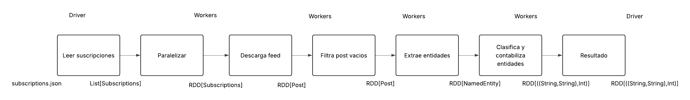
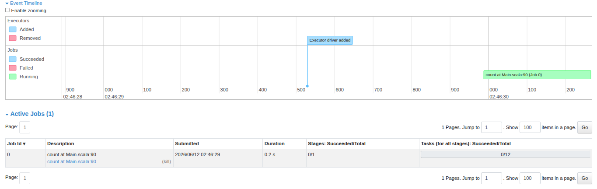

# Procesamiento distribuido con Apache Spark

## Ejercicio 1 - Identificar las regiones paralelizables

> a. Dibujen el diagrama de flujo de los pasos que tiene que hacer su programa
> (conexión, descarga, extracción de entidades, clasificación, conteo, ranking) como un
> grafo de dependencias (que seguramente será algo muy parecido a una secuencia).
> Cada uno de los pasos será una acción o transformación que realiza un worker o el
> driver. La conexión entre un paso A y un paso B es el output de A y el input de B. Explicite el tipo en Scala de cada conexión.

Diagrama de flujo del pipeline: se muestra el recorrido de los datos desde la lectura de las suscripciones hasta el conteo y clasificación de entidades, indicando los tipos de datos intercambiados entre cada etapa y la participación del driver (donde intervienen en el inicio para leer las suscripciones y coordinar la ejecución distribuida como también al final del pipeline para agrupar los resultados y mostrarlos) y los workers.
    

>b. Para cada paso del pipeline, determinen si puede expresarse como una de las abstracciones de Spark:
>- map: transforma cada elemento en exactamente un resultado. Aplicable cuando
>cada tarea es independiente y produce exactamente una salida.
>- flatMap: transforma cada elemento en cero o más resultados. Aplicable cuando
>cada tarea es independiente pero puede producir una cantidad variable de salidas.
>- reduceByKey u otra reducción: combina múltiples elementos en uno agrupando
>por clave. Aplicable cuando el resultado depende de todos los elementos, no de uno solo.
>¿Hay algún paso del pipeline que no encaje en ninguna de estas abstracciones? ¿Por qué?

Luego de realizar el gráfico,  se pudo identificar que la Contabilización de Entidades puede expresar con una de las abstracciones de Spark que es reduceByKey ya que se agrupan las entidades con la misma clave y se suma las ocurrencias para obtener el conteo total de cada una.
Por otro lado,  Descargar Feeds puede expresarse mediante flatmap ya que cada suscripción puede producir una cantidad variable de posts, es decir, puede no devolver ningun post valido o puede devolver varios posts, por lo que la relación ya es de muchos a muchos respecto a la entrada y salida, lo mismo pasa con la Extracción de Entidades ya que cada post puede obtener 0 o varias entidades nombradas.
Y map se utiliza para la Clasificación de Entidades porque transformamos cada entidad en un par clave-valor produciendo una salida por entidad. 
El caso donde no encaja con ninguna de las abstracciones que ofrece Spark seria cuando filtramos los post vacíos o que no cumplen con los requisitos pedidos, ya que estamos usando filter donde se encarga de conservar aquellos elementos que satisfacen la condición.

>c. Las reducciones constituyen una barrera de sincronización: ningún worker puede
>producir el resultado final hasta que todos hayan terminado su parte. Identifiquen qué
>pasos del pipeline son barreras y cuáles pueden ejecutarse de forma completamente
>independiente entre workers.

Los pasos de Descargar Feed, Filtrar Post, Extraer Entidades pueden ejecutarse de forma independiente entre los workers. Esto se debe porque son tareas que cada worker puede procesar los datos que le fueron asignados sin necesitar información de otro.
En cambio el paso barrera de sincronización viene a ser Clasificar y Contabilizar Errores  
ya que para obtener la cantidad de apariciones de cada entidad es necesario combinar los resultados generados por todos los workers.
Por ejemplo: si tenemos Worker 1 -> Scala = 2 Worker 2 -> Scala = 3 Worker 3 -> Scala = 1 
y queremos saber cuántas veces apareció Scala en total hay que juntar  los resultados de todos los workers (Scala = 6).


>d. El mecanismo de extensión (extension point) de Spark es la función que el
>desarrollador le pasa a cada transformación. ¿Qué restricciones impone Spark sobre
>esas funciones para que puedan ejecutarse en un entorno distribuido? Piensen en
>serialización, estado compartido y efectos secundarios.


Esta pregunta, reformulándola, se refiere a qué características debe tener una función para que Spark pueda ejecutarla en distintos workers de forma distribuida. Una de las principales restricciones es que dichas funciones deberían ser lo más puras posible, tal como se trabajó en el Laboratorio 1. Esto implica evitar depender de variables externas o de estado compartido, ya que cada worker ejecuta una copia independiente de la función. Además, Spark debe poder enviar estas funciones desde el driver hacia los workers para que puedan ejecutarse de manera distribuida.


## Ejercicio 2 - Paralelizar la descarga de feeds

>Al escribir el flatMap, manejen los errores dentro de la función de forma que un fallo
>no cancele el procesamiento del resto. En Informe.md expliquen qué pasaría si dejaran
>propagar la excepción.

Si la excepción se propaga fuera del flatMap, Spark la trata como un fallo de tarea. Dependiendo de la configuración, reintenta la tarea N veces y si sigue fallando, cancela el job completo. Esto significa que un único feed con timeout o error HTTP derribaría el procesamiento de todos los demás feeds, lo cual es inaceptable para un pipeline que debe ser tolerante a fallos.

## Ejercicio 3 - Paralelizar el computo de entidades nombradas

>ReduceByKey es una barrera de sincronización. ¿Qué ocurre en el cluster en ese punto? ¿Por qué es inevitable para este problema?

En el cluster en ese punto se hace un shuffle, es decir, los workers intercambian datos para que todos los pares clave-valor terminen recien en el mismo worker entonces puede aplicar la reducción. 
Es inevitable para este problema porque no se podría hacer la reducción correcta si los datos estan distribuidos entre los workers, la forma de unificarlos es que un solo worker tenga todas las clave-valor que son iguales para poder hacer la correcta reducción.  

>¿Qué restricciones debe cumplir la función que se le pasa a reduceByKey? Piensen en conmutatividad y asociatividad.

La operacion tiene que ser asociativa y conmutativa porque los datos llegaran en cualquier orden entonces 
(a+b)+c = a+(b+c) y a+b=b+a si no cumple estas propiedades como Spark trabaja en paralelo podría dar resultados distintos según como reparta el trabajo y no queremos eso. 

>¿Dónde se hace la lectura del diccionario de entidades? ¿En el driver o los workers?

La lectura del diccionario se hace desde el disco en Dictionary.loadAll luego el driver lo distribuye a los workers usando sc.broadckast y cada worker utiliza su copia local 

## Ejercicio 4 -  Monitoreo del éxito de las tareas
> ¿Por qué los Accumulators solo deben usarse para métricas y no para tomar
decisiones lógicas dentro de las etapas distribuidas del pipeline? ¿En qué
situación un Accumulator puede dar un valor incorrecto?

Los Accumulators solo deben usarse para métricas, no para controlar lógicas del
pipeline, porque su valor no es determinista en presencia de reintentos de
trabajo o ejecución especulativa. Si una tarea falla y se reintenta, Spark puede
volver a ejecutar el mismo fragmento de código y sumar de nuevo el acumulador,
lo que lleva a un conteo mayor al real. Por eso no es fiable usar un
Accumulator para tomar decisiones condicionadas dentro de una transformación.

Un caso típico de valor incorrecto es cuando una tarea se ejecuta dos veces por
fallo o speculative execution: ambas ejecuciones pueden incrementar el mismo
Accumulator, y el valor final reflejará la suma de ambas ejecuciones, no la
cantidad real de eventos únicos.

> ¿En qué momento del pipeline está disponible el valor de un Accumulator para
ser leído por el driver?

El valor de un Accumulator está disponible en el driver solo después de que la
acción que materializa el RDD donde se actualiza haya terminado. Es decir,
no tiene sentido leerlo mientras el pipeline sigue pendiente; debe leerse
tras la ejecución completa de la acción que fuerza la evaluación de sus
actualizaciones. En el `Main.scala` del proyecto, los valores de los
acumuladores se pueden leer una vez que se hayan completado las acciones como
`count()` sobre `postsRDD` y `filteredPostsRDD`.

> Comparen el tiempo que tarda cada etapa del pipeline que midieron en la versión no paralelizada y la versión con Spark. ¿Qué conclusiones pueden sacar?
> Para la cantidad de datos que estamos trabajando, ¿se aprecia la diferencia?
> Justifique por qué. Nota: La comparación debe realizarse en ejecuciones sobre la
> misma computadora y la misma conexión a internet.
versión no paralelizada y la versión con Spark. ¿Qué conclusiones pueden sacar?
Para la cantidad de datos que estamos trabajando, ¿se aprecia la diferencia?
Justifique por qué. Nota: La comparación debe realizarse en ejecuciones sobre la
misma computadora y la misma conexión a internet

Para los volúmenes de datos de este proyecto, la mejora de tiempo entre la
versión no paralelizada y la versión con Spark puede ser modesta o incluso
nula en una sola computadora. Spark introduce sobrecarga de creación de jobs,
serialización y planificación, por lo que en un dataset pequeño el tiempo de
configuración puede compensar el beneficio del paralelismo. En cambio, la
ventaja de Spark se aprecia mejor en cargas grandes, donde el trabajo se
puede distribuir efectivamente entre varios cores o nodos.

En este caso concreto, la diferencia es pequeña porque el pipeline descarga y
procesa relativamente pocos posts, y la mayor parte del tiempo puede estar en
la latencia de red. Por eso, sobre la misma máquina y conexión, la versión con
Spark puede ser similar a la versión secuencial, aunque sigue siendo más clara
conceptualmente y preparada para escalar si aumentan los datos.

## Ejercicio 5 - Acceso a datos y estadísticas del resultado

> ¿Qué ocurriría si no llamaran a cache()? ¿Cuántas veces se ejecutaría la descarga de feeds?

Sin `cache()`, la descarga de feeds se ejecutaría **3 veces**:
1. Primera vez al llamar `postsRDD.count()` para obtener `totalPostsCount`
2. Segunda vez al llamar `filteredPostsRDD.count()` para obtener `filteredCount` — porque `filteredPostsRDD` depende de `postsRDD`
3. Tercera vez al hacer `filteredPostsRDD.flatMap(...)` para extraer entidades — porque `filteredPostsRDD` depende de `postsRDD`

Con `cache()`, la descarga se ejecuta una sola vez y luego se reutilizan los datos de la memoria cache en los accesos posteriores.

> ¿Por qué es incorrecto llamar a collect() entre los pasos a) y b) del ejercicio 3 y luego continuar el pipeline? ¿Qué consecuencia tiene sobre la distribución del trabajo?

Llamar `collect()` entre `entitiesRDD` (paso a: flatMap) y `entityPairsRDD` (paso b: map) sería incorrecto porque:
- `collect()` trae todos los datos al driver, lo que pierde el paralelismo distribuido.
- Los workers no participarían en los pasos siguientes; el trabajo continuar local en el driver.
- La agregación con `reduceByKey` sucedería en el driver en modo local, no distribuida en los workers.
- Se pierde completamente la capacidad de escalar a clusters grandes, ya que el driver tendría que almacenar toda la colección en memoria, lo cual es un cuello de botella.

> cache() es también lazy. ¿En qué momento se almacena realmente el RDD en memoria?

`cache()` no almacena nada inmediatamente; solo marca el RDD para ser cacheado. El almacenamiento real ocurre cuando:
- Se ejecuta la **primera acción** sobre ese RDD (o un RDD descendiente que depende de él).
- En el código: `postsRDD.cache()` se almacena cuando se llama `postsRDD.count()` (línea ~100), momento en el cual Spark evalúa toda la lineage y almacena el resultado en memoria.
- Y `filteredPostsRDD.cache()` se almacena cuando se llama `filteredPostsRDD.count()` (línea ~105).
- Después, cualquier uso posterior de ese RDD obtiene datos del cache, sin recomputar la lineage.

## Evidencia de Ejecución — Spark Jobs


Observaciones relevantes:

- Las 12 tareas indican el grado de paralelismo (particiones) sobre el que se ejecutó la operación.
- El evento de adición del executor confirma la asignación de recursos por parte del cluster justo antes del inicio del job.
- El conteo de 0/12 tareas completadas en el instante capturado sugiere que la medición fue tomada durante el arranque; el valor de `0.2 s` puede corresponder al tiempo transcurrido hasta la captura y no al tiempo total final si el job continuó.

## Estadisticas de Entidades
```bash
[info] ============ ESTADÍSTICAS DE ENTIDADES ============
[info] Entidades totales: 57
[info] Entidades por categoría:
[info]     [Person]: 2
[info]     [Organization]: 11
[info]     [University]: 0
[info]     [Place]: 2
[info]     [Technology]: 0
[info]     [ProgrammingLanguage]: 42
[info] Tiempo para contar filteredPosts: 44 ms
[info] Tiempo para contar totalPosts: 5317 ms


```
